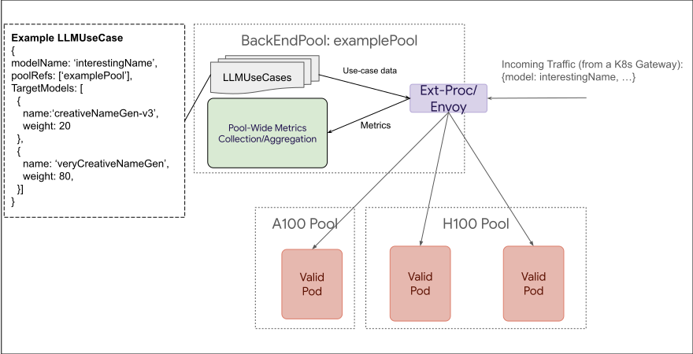
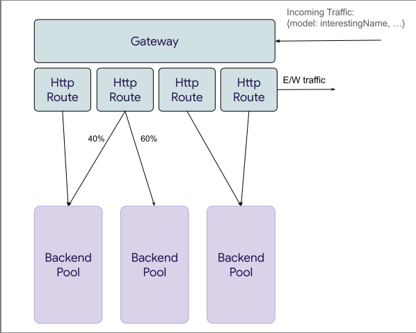

# LLM Instance Gateway

## Proposal Status
 ***Draft***

## Table of Contents

<!-- toc -->

-   [Summary](#summary)
-   [Goals](#goals)
-   [Non-Goals](#non-goals)
-   [Proposal](#proposal)
    -   [Personas](#personas)
        -   [Inference Platform Admin](#inference-platform-admin)
        -   [LLM Use Case Owner](#llm-use-case-owner)
    -   [Axioms](#axioms)
    -   [BackendPool](#backendpool)
    -   [LLMUseCase](#llmusecase)
    -   [Spec](#spec)
    -   [Diagrams](#diagrams)
    -   [Alternatives](#alternatives)
- [FAQ](#faq)
- [Open Questions](#open-questions)
    
<!-- /toc -->

## Summary

This proposal presents 2 new CRD objects to express the needs of the LLM Instance Gateway. **BackendPool** and **LLMUseCase** (names up for debate). The BackendPool is the logical grouping of compute, owned by the Inference Platform Admin persona. While the LLMUseCase is used to define objectives, the LoRA Adapter(s) used by the Use Case, and is owned by the LLM Use Case Owner.

## Goals

- Drive concensus on direction of LLM Instance Gateway Solution
- Documentation of API decisions for posterity

## Non-Goals

- Hash out every implementation detail
- Be a formal KEP

## Proposal

### Personas

Before diving into the details of the API, decriptions of the personas will help shape the thought process of the API design.

#### Inference Platform Admin

The Inference Platform Admin creates and manages the infrastructure necessary to run LLM workloads. Including handling Ops for: 
  - Hardware
  - Model Server
  - Base Model
  - Resource Allocation for Workloads
  - Gateway configuration
  - etc

#### LLM Use Case Owner

Owns... An LLM based... Use Case...

Okay, seriously. An LLM Use Case Owner persona owns and manages 1 or many Generative AI Workloads (LLM focused *currently*). This includes:
- Defining SLO
- Deploying LoRA Adapters (or other fine-tune)
- Managing rollout of adapters

### Axioms 

The API design is based on these axioms:

- Pools of shared compute should be *discrete* for scheduling to properly work
- Pod-level scheduling should not be handled by a high-level gateway 
- Simple use cases should be simple to define (or are implicitly defined via reasonable defaults)
- This solution should be composable with other Gateway solutions and flexible to fit customer needs
- The MVP will heavily assume requests are done using the OpenAI spec, but open to extension in the future

The [PoC](https://youtu.be/NUBZg_uqqXk?si=v681EeYdGUGEVqQQ&t=1458) was focused on lower-level scheduling. And the API follows that similar logic, which lead to the proposal of the **BackendPool**.

### BackendPool

The BackendPool at its core is a logical grouping of compute, expressed in the form of Pods (typically model servers), akin to a K8s Service. The BackendPool would deploy its own routing, and offer administrative configuration to the Platform Admin. 

 It is expected for the BackendPool to:
 - Enforce fair consumption of resources across competing use cases
 - Efficiently route requests across shared compute (as displayed by the PoC)
 
It is _not_ expected for the BackendPool to:
 - Enforce any common set of adapters or base models are available on the Pods
 - Manage Deployments of Pods within the Pool
 - Manage Pod lifecycle of pods within the pool 

Additionally, any Pod that seeks to join a BackendPool would need to support a protocol, defined by LLM Instance Gateway, to ensure the Pool has adequate information to intelligently route requests.

### LLMUseCase

An LLMUseCase allows the UseCaseOwner to define:
- Which LoRA adapter(s) to consume 
  - LLMUseCase allows for traffic splitting between adapters _in the same pool_ to allow for new LoRA adapter versions to be easily rolled out 
- SLO objectives for the UseCAse
- The Pools this UseCase is relevant to 

### Spec

**BackendPool**
```golang
// A grouping of model serving instances that are expected to serve the same model(s) and speak the same API protocol
// The LLMBackendPool is also the scope for enforcing priority and fairness across different use cases.
// When used with the Gateway API, the LLMBackendPool can serve as the BackendRefs of an HTTPRoute.
// Generally the LLMBackendPool is owned by the "Inference Platform Admin" persona.
type LLMBackendPool struct {
        metav1.ObjectMeta
        metav1.TypeMeta
        Spec LLMBackendSpec
}

type LLMBackendPoolSpec struct {
        // Pod selector, similar to k8s Service.
        Selector map[string]string `json:"selector,omitempty"`
        // Allows names within the `model` param that don't have an explicitly defined UseCase to pass through. Defaults to `false`.
        AllowUndefinedModels bool
        // Admin-defined minimum objective value that can be requested, will cause an error in LLMUseCase if limit is broken.
        MinTPOT float32
}
```


**LLMUseCase**
```golang
// LLMUseCase represents a use case of an LLM, which is multiplexed onto one or more LLMBackendPools.
// It allows mapping a use case to backend pools, and models or adapters that backend model servers understand.
// The LLMUseCase defines request routing behavior within an LLMBackendPool.
// Generally the LLMUseCase is owned by the "LLM Use Case Owner" persona, which can be teams in an organization.
type LLMUseCase struct {
        metav1.ObjectMeta
        metav1.TypeMeta

        Spec LLMUseCaseSpec
}

type LLMUseCaseSpec struct {
        // Map use case to one or more backend pools.
        // In the most common case, this should be a single backend pool.
        // Multiple backend pools can be used for traffic splitting while migrating to a new backend pool.
        Rules   []LLMUseCaseRule
}

// LLMUseCaseRule represents a mapping from a LLMUseCase to a backend pool and adapters/models in that pool.
type LLMUseCaseRule struct {
        // The name used in the `model` param of incoming requests
        ModelName string
        // Optional
        Objective *Objective
        // Required.
        // Reference to an LLMBackendPool. This allows registering a use case
        // as valid on a pool. 
        // NOTE: Allowing multiple pools is a configuration convenience.
        PoolRef []corev1.ObjectReference
        // Optional.
	    // Allow multiple versions of a model for traffic splitting. 
	    // If not specified, the target model name is defaulted to the 
        // modelName parameter.
        TargetModels []common.TargetModel
}


// TargetModel represents a deployed model or a LoRA adapter.
type TargetModel struct {
        // The name of the adapter expected by the ModelServer.
        TargetModelName string
        // Weight is used to determine the percentage of traffic that should be 
        // sent to this target model when
        // multiple versions of the models are specified.
        Weight int
}

// Objective defines the performance targets of a LLM use case.
// NOTE: Objectives are best effort
type Objective struct {
        // Only one target can be set.
        TPOT    []LatencyTarget
        FairnessWeight int
}


type LatencyTarget struct {
        Percentile float64       `json:"percentile,omitempty"`
        Target       time.Duration `json:"target,omitempty"`
}
```

### Diagrams

Much of this is better explained visually:

Below is a detailed view of the BackendPool



This diagram lightly follows the example request for a model `interestingName`. 
The flow can be described as:
- The request comes in to our routing solution(Ext-Proc)
- ExtProc looks up the UseCases affiliated with this pool `examplePool`
- `interestingName` is currently undergoing a change of LoRA adapters from `creativeNameGen-v3` (20% traffic split) to `veryCreativeNameGen` (80% traffic split)
- `veryCreativeNameGen` is selected as the LoRA adapter, and replaces `interestingName` in the body of the request (mutated by ext-proc) 
- the request is then efficiently scheduled onto one of the valid Pods
- metrics are sent back to the BEP, aggregated and re-emitted via sidecar (following the metric standardization)

How Multiple BackendPools might integrate together:



Here we see that we can have:
- Multiple Routes pointing to the same pool
- Routes splitting traffic across multiple pools

The functionality of the Kubernetes Gateway is unchanged with this proposal, allowing seamless integration with the BackendPool.


### Alternatives

#### Key Decisions

Our alternatives hinge on some key decisions:
- Allowing HTTPRoute to treat the BackendPool as the backendRef
- Creating a separate layer of abstraction, instead of extending HTTPRoute

#### LLMUseCase as a backend ref

We toyed with the idea of allowing an LLMUsecase be the target of an HTTPRouteRules backend ref. However, doing so would require the Kubernetes Gateway to be able to interpret body level parameters, and require that the HTTPRoute also specify the backend the UseCase is intended to run on. All of which would require substantial work on the Kubernetes Gateway, while not providing much flexibility.

#### LLMRoute

Our original idea was to define all UseCase config at the Kubernetes Gateway layer, and have no BackendPool. This is inherently challenging, as LLMRoute would become a superset of HTTPRoute, or the Gateway would become bespoke, and work only for the LLMRoute use case.

## FAQ
- Why 2 layers of weighting? (HttpRoute & UseCase)
  - Feasibly done - No extension of HttpRoute. Just works, as BackendPool operates like a service.
  - Complexity is only expressed during transition states (model version upgrade)
  - Keeps Pools self contained - multiple K8s gateways can direct traffic to the same pool without needing to re-express Pool-level behavior
- What is a backend pool attempting to define?
  - BackendPool groups resources that should be shared over the UseCases that are affiliated with the pool
  - Best practice would also suggest keeping the same base model for all ModelServers in the pool, but that is not enforced


## Open Questions

- Reasonable defaults
  - Should use cases be required? Or can a customer simply create a pool, and direct requests to the pool, and expect even fairness/priority across the different LoRA adapters that are requested?
    - If so? How should we handle the mix between explicit and implicit use cases? Are implicit usecases just default everything? (and inherently lower prio).
    - NOTE: Current thinking is this is yes we should allow non-use case defined requests, but is a security risk if on by default. So pools should opt-in
- Configuration control
  - How many routing decisions should we make on behalf of the user vs allow for configuration?
     - Do we decide that SLO adherence is stricter than Fariness adherence? Do we allow for configuration of such tooling? (would be expressed in the BackendPool API)
