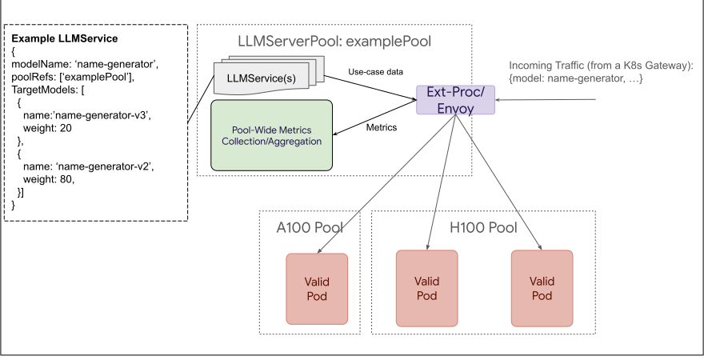

# LLM Instance Gateway

## Proposal Status
 ***Draft***

## Table of Contents

<!-- toc -->

-   [Summary](#summary)
-   [Goals](#goals)
-   [Non-Goals](#non-goals)
-   [Proposal](#proposal)
    -   [Personas](#personas)
        -   [Inference Platform Admin](#inference-platform-admin)
        -   [LLM Use Case Owner](#llm-use-case-owner)
    -   [Axioms](#axioms)
    -   [LLMServerPool](#llmServerPool)
    -   [LLMService](#LLMService)
    -   [Spec](#spec)
    -   [Diagrams](#diagrams)
    -   [Alternatives](#alternatives)
- [FAQ](#faq)
- [Open Questions](#open-questions)
    
<!-- /toc -->

## Summary

This proposal presents 2 new CRD objects to express the needs of the LLM Instance Gateway. **LLMServerPool** and **LLMService** (names up for debate). The LLMServerPool is the logical grouping of compute, owned by the Inference Platform Admin persona. While the LLMService defines the serving objectives of a specific model or LoRA adapter, and is owned by the LLM Use Case Owner.

**NOTE: Some routing terms are defined in the [glossary](./glossary.md) file, to more deeply describe how we will handle behaviors like priority and fairness**

## Goals

- Drive concensus on direction of LLM Instance Gateway Solution
- Documentation of API decisions for posterity

## Non-Goals

- Hash out every implementation detail
- Be a formal KEP

## Proposal

### Personas

Before diving into the details of the API, decriptions of the personas will help shape the thought process of the API design.

#### Inference Platform Admin

The Inference Platform Admin creates and manages the infrastructure necessary to run LLM workloads. Including handling Ops for: 
  - Hardware
  - Model Server
  - Base Model
  - Resource Allocation for Workloads
  - Gateway configuration
  - etc

#### LLM Use Case Owner

An LLM Use Case Owner persona owns and manages 1 or many Generative AI Workloads (LLM focused *currently*). This includes:
- Defining SLO
- Managing fine-tunes
  - LoRA Adapters
  - System Prompts
  - Prompt Cache
  - etc.
- Managing rollout of adapters

### Axioms 

The API design is based on these axioms:

- Pools of shared compute should be *discrete* for scheduling to properly work
- Pod-level scheduling should not be handled by a high-level gateway 
- Simple use cases should be simple to define (or are implicitly defined via reasonable defaults)
- This solution should be composable with other Gateway solutions and flexible to fit customer needs
- The MVP will heavily assume requests are done using the OpenAI spec, but open to extension in the future
- The Gateway should route in a way that does not generate a queue of requests at the model server level

The [PoC](https://youtu.be/NUBZg_uqqXk?si=v681EeYdGUGEVqQQ&t=1458) was focused on lower-level scheduling. And the API follows that similar logic, which lead to the proposal of the **LLMServerPool**.

### LLMServerPool

The LLMServerPool at its core is a logical grouping of compute, expressed in the form of Pods (typically model servers), akin to a K8s Service. The LLMServerPool would deploy its own routing, and offer administrative configuration to the Platform Admin. 

 It is expected for the LLMServerPool to:
 - Enforce fair consumption of resources across competing use cases
 - Efficiently route requests across shared compute (as displayed by the PoC)
 
It is _not_ expected for the LLMServerPool to:
 - Enforce any common set of adapters or base models are available on the Pods
 - Manage Deployments of Pods within the Pool
 - Manage Pod lifecycle of pods within the pool 

Additionally, any Pod that seeks to join a LLMServerPool would need to support a protocol, defined by LLM Instance Gateway, to ensure the Pool has adequate information to intelligently route requests.

### LLMService

A LLMService allows the LLMServiceOwner to define:
- Which LoRA adapter(s) to consume 
  - LLMService allows for traffic splitting between adapters _in the same LLMServerPool_ to allow for new LoRA adapter versions to be easily rolled out 
- SLO objectives for the LLMService
- The Pools this LLMService is relevant to 

### Spec

**LLMService**
```golang
// LLMService represents a set of LLM use cases that are multiplexed onto one 
// or more backend pools. This resource is managed by the "LLM Service Owner"
// persona. The model use case owner a team that trains, verifies, and
// leverages a large language model from a model frontend, drives the lifecycle
// and rollout of new versions of those models, and defines the specific
// performance and latency goals for the model. These model use cases are
// expected to operate within a LLMServerPool sharing compute capacity with other
// LLMServices, defined by the Inference Platform Admin. We allow a user who
// has multiple LLMServices across multiple pools (with the same config) to
// specify the configuration exactly once, and deploy to many pools 
// simultaneously. Enabling a simpler config and single source of truth
// for a given user. LLMService names are unique for a given LLMServerPool,
// if the name is reused, an error will be  shown on the status of a 
// LLMService that attempted to reuse. The oldest LLMService, based on
// creation timestamp, will be selected to remain valid. In the event of a race
// condition, one will be selected at random. 
type LLMService struct {
        metav1.ObjectMeta
        metav1.TypeMeta

        Spec LLMServiceSpec
}

type LLMServiceSpec struct {
        // Defines the use cases in the set.
        // LLMServices can be in 2 priority classes, Critical and Noncritical. 
        // Priority class is implicitly set to Critical by specifying an Objective.
        // Otherwise the LLMService is considered Noncritical.
        LLMServices   []ModelLLMServices
        // Reference to the backend pools that the use cases registers to.
        PoolRef []corev1.ObjectReference
}

// LLMService defines the policies for routing the traffic of a use case, this includes performance objectives 
// and traffic splitting between different versions of the model.
type ModelLLMServices struct {
        // The name of the model as the users set in the "model" parameter in the requests.
        // The model name should be unique among the use cases that reference the same backend pool.
        // This is the parameter that will be used to match the request with. In the future, we may
        // allow to match on other request parameters. The other approach to support matching on 
        // on other request parameters is to use a different ModelName f HTTPFilter 
        ModelName string
        // Optional
        // Use cases with an objective have higher priority than use cases without.
        // IMPORTANT: By specifying an objective, this places the LLMService in a higher priority class than LLMServices without a defined priority class. 
        // In the face of resource-scarcity. Higher priority requests will be preserved, and lower priority class requests will be rejected.
        Objective *Objective
        // Optional.
	// Allow multiple versions of a model for traffic splitting. 
	// If not specified, the target model name is defaulted to the modelName parameter.
        TargetModels []common.TargetModel
}


// TargetModel represents a deployed model or a LoRA adapter. The
// TargetModelName is expected to match the name of the LoRA adapter
// (or base model) as it is registered within the model server. Inference
// Gateway assumes that the model exists on the model server and is the
// responsibility of the user to validate a correct match. Should a model fail
// to exist at request time, the error is processed by the Instance Gateway,
// and then emitted on the appropriate LLMService object.
type TargetModel struct {
        // The name of the adapter as expected by the ModelServer.
        TargetModelName string
        // Weight is used to determine the percentage of traffic that should be 
        // sent to this target model when multiple versions of the model are specified.
        Weight int
}

// Objective captures the latency SLO of a LLM use case.
// In MVP, meeting the SLO is on a best effort basis.
// Future: Extend the API for different behaviors of meeting the SLO.
// The gateway will perform best-effort load balancing, and work with other components (e.g., autoscaler) to meet the
// objectives. 
type Objective struct {
        // The AverageLatencyPerOutputToken is calculated as the e2e request latency divided by output token 
        // length. Note that this is different from what is known as TPOT (time per output token) which only 
        // takes decode time into account.
        // The P95 is calculated over a fixed time window defined at the operator level.
        DesiredAveragePerOutputTokenLatencyAtP95OverMultipleRequests
    *time.Duration
}
```

**LLMServerPool**
```golang
// The LLMServerPool is a construct for pooling compute (often model servers) to
// serve large models, that have the ability to share capacity across multiple
// use cases (such as through prompt engineering, LoRA adapters, etc).
// LLMServerPools have a dependency on a Gateway that is compatible with ext-proc
// (External Processing). When a new LSP object is created, a new ext proc
// deployment is created. LLMServerPools require at minimum a single LLMService to
// be subscribed to them to accept traffic, any traffic with a model not
// definied within a LLMService will be rejected.
type LLMServerPool struct {
        metav1.ObjectMeta
        metav1.TypeMeta

        Spec LLMServerPoolSpec
}

type LLMServerPoolSpec struct {
        // Select the distinct services to include in the backend pool. These
        // services should be consumed by only the llmServerPool they are part
        // of. Should this behavior be breached, routing behavior is not
        // guaranteed.
        ServiceRef []corev1.ObjectReference
}
```

### Yaml Examples

#### LLMServerPool(s)
Here we create 2 LSPs that subscribe to services to collect the appropriate pods
```yaml
apiVersion: inference.x-k8s.io/v1alpha1
kind: LLMServerPool
metadata:
  name: llama-2-pool
  services: 
  - llama-2-vllm
---
apiVersion: inference.x-k8s.io/v1alpha1
kind: LLMServerPool
metadata:
  name: gemini-pool
  services: 
  - gemini-jetstream-tpu-v5e
  - gemini-vllm-a100
```

#### LLMService

Here we consume both pools with a single LLMService, while also specifying 2 LLMServices. Where `sql-code-assist` is both the name of the ModelLLMService, and the name of the LoRA adapter on the model server. And `npc-bot` has a layer of indirection for those names, as well as a specified objective. Both `sql-code-assist` and `npc-bot` have available LoRA adapters on both LLMServerPools and routing to each LLMServerPool happens earlier(at the K8s Gateway). So traffic splitting between separate pools happens at the K8s Gateway.
```yaml
apiVersion: inference.x-k8s.io/v1alpha1
kind: LLMService
metadata:
  name: my-llm-service
spec:
  LLMServices:
  - modelName: sql-code-assist
  - modelName: npc-bot
    objective: 
      desiredAveragePerOutputTokenLatencyAtP95OverMultipleRequests: 50ms
    targetModels:
      targetModelName: npc-bot-v1
        weight: 50
      targetModelName: npc-bot-v2
        weight: 50 	
  poolRef: 
   - name: llama-2-pool
   - name: gemini-pool
```

### Diagrams

Much of this is better explained visually:

Below is a detailed view of the LLMServerPool



This diagram lightly follows the example request for a model `interestingName`. 
The flow can be described as:
- The request comes in to our routing solution(Ext-Proc)
- ExtProc looks up the LLMServices affiliated with this pool `examplePool`
- `interestingName` is currently undergoing a change of LoRA adapters from `creativeNameGen-v3` (20% traffic split) to `veryCreativeNameGen` (80% traffic split)
- `veryCreativeNameGen` is selected as the LoRA adapter, and replaces `interestingName` in the body of the request (mutated by ext-proc) 
- the request is then efficiently scheduled onto one of the valid Pods
- Prometheus metrics are sent back to the LSP, aggregated and re-emitted via sidecar (following the metric standardization)

How Multiple LLMServerPools might integrate together:


Here we see that we can have:
- Multiple Routes pointing to the same pool
- Routes splitting traffic across multiple pools

The functionality of the Kubernetes Gateway is unchanged with this proposal, allowing seamless integration with the LLMServerPool.


### Alternatives

#### Key Decisions

Our alternatives hinge on some key decisions:
- Allowing HTTPRoute to treat the LLMServerPool as the backendRef
  - Whereas the alternatives might have the LLMService as the backend ref
- Creating a separate layer of abstraction, instead of extending HTTPRoute
  - Explained in more detail in the LLMRoute section

#### LLMService as a backend ref

We toyed with the idea of allowing an LLMService be the target of an HTTPRouteRules backend ref. However, doing so would require the Kubernetes Gateway to be able to interpret body level parameters (assuming OpenAI protocol continues to require the model param in the body), and require that the HTTPRoute also specify the backend the LLMService is intended to run on. Since we our primary proposal already specifies the backend, packing this functionality would require substantial work on the Kubernetes Gateway, while not providing much flexibility.

#### LLMRoute

Our original idea was to define all LLMService config at the Kubernetes Gateway layer, and have no LLMServerPool. This is inherently challenging, as LLMRoute would become a superset of HTTPRoute, or the Gateway would become bespoke, and work only for the LLMRoute use case.

## FAQ
- **Why 2 layers of weighting?** (HttpRoute & LLMService)
  - Feasibly done - No extension of HttpRoute. Just works, as LLMServerPool operates like a service.
  - Complexity is only expressed during transition states (model version upgrade)
  - Keeps Pools self contained - multiple K8s gateways can direct traffic to the same pool without needing to re-express Pool-level behavior
- **What is a LSP attempting to define?**
  - LLMServerPool groups resources that should be shared over the LLMServices that are affiliated with the pool
  - Best practice would also suggest keeping the same base model for all ModelServers in the pool, but that is not enforced
- **Can a LLMService reference multiple LSPs?**
- **How is this deployed?**
  - We will follow [common patterns](https://gateway.envoyproxy.io/docs/tasks/quickstart/#installation) to install the CRDs & Controllers
- **Are all controllers necessary for this solution going to be provided by Instance Gateway(this repo)?**
  - Yes


## Open Questions

- Reasonable defaults (how do we behave in the absence of user-specified values in optional fields)
  - Should use cases be required? Or can a customer simply create a pool, and direct requests to the pool, and expect even fairness/priority across the different LoRA adapters that are requested?
    - If so? How should we handle the mix between explicit and implicit use cases? Are implicit LLMServices just default everything? (and inherently lower prio).
    - NOTE: Current thinking is this is yes we should allow non-use case defined requests, but is a security risk if on by default. So pools should opt-in
- Configuration control
  - How many routing decisions should we make on behalf of the user vs allow for configuration?
     - Do we decide that SLO adherence is stricter than Fairness adherence? Do we allow for configuration of such tooling? (would be expressed in the LLMServerPool API)
