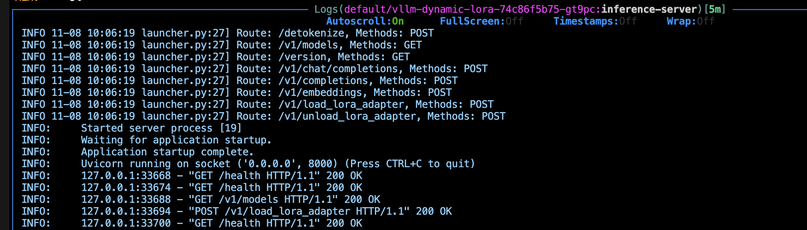

# Dynamic LORA Adapter Sidecar for vLLM

This directory contains a configmap containing lora adapters configurations and script for a sidecar container to dynamically manage LORA adapters for a vLLM server running in the same Kubernetes pod by reconciling it with a configmap containing lora adapters. 

## Overview

The sidecar continuously monitors a ConfigMap mounted as a YAML configuration file. This file defines the desired state of LORA adapters, including:

- **Adapter ID:** Unique identifier for the adapter.
- **Source:** Path to the adapter's source files.
- **Base Model:** The base model to which the adapter should be applied.
- **toRemove:** (Optional) Indicates whether the adapter should be unloaded.

The sidecar uses the vLLM server's API to load or unload adapters based on the configuration. It also periodically reconciles the registered adapters on the vLLM server with the desired state defined in the ConfigMap, ensuring consistency.

## Features

- **Dynamic Loading and Unloading:**  Load and unload LORA adapters without restarting the vLLM server.
- **Continuous Reconciliation:**  Ensures the vLLM server's state matches the desired configuration.
- **ConfigMap Integration:**  Leverages Kubernetes ConfigMaps for easy configuration management.
- **Easy Deployment:**  Provides a sample deployment YAML for quick setup.

## Repository Contents

- **`sidecar.py`:**  Python script for the sidecar container.
- **`Dockerfile`:**  Dockerfile to build the sidecar image.
- **`configmap.yaml`:**  Example ConfigMap YAML file.
- **`deployment.yaml`:**  Example Kubernetes deployment YAML.

## Usage

1. **Build the Docker Image:**
   ```bash
   docker build -t <your-image-name> .
2. **Create a configmap:**
    ```bash
    kubectl create configmap name-of-your-configmap --from-file=your-file.yaml
3. **Mount the configmap and configure sidecar in your pod**
    ```yaml
    volumeMounts: # DO NOT USE subPath
          - name: config-volume
            mountPath:  /config
    ```
    Do not use subPath, since configmap updates are not reflected in the file

[deployment]: deployment.yaml

## Screenshots & Testing
I tested the sidecar in my cluster with deployment and configmap specified in this repo. Here are the screen grabs of the logs from the sidecar and vllm server.



