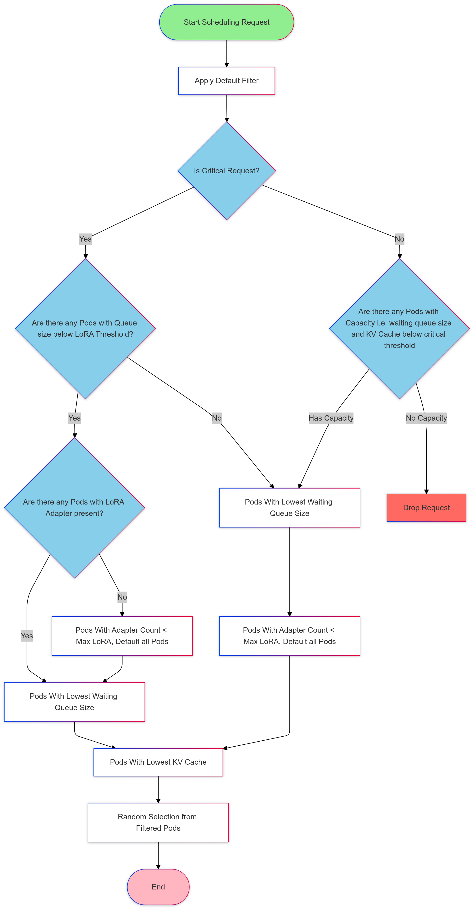

## Quickstart

### Requirements
The current manifests rely on Envoy Gateway [v1.2.1](https://gateway.envoyproxy.io/docs/install/install-yaml/#install-with-yaml) or higher.

### Steps

1. **Deploy Sample vLLM Application**

   A sample vLLM deployment with the proper protocol to work with LLM Instance Gateway can be found [here](https://github.com/kubernetes-sigs/llm-instance-gateway/tree/main/examples/poc/manifests/vllm/vllm-lora-deployment.yaml#L18).

1. **Deploy InferenceModel and InferencePool**

   You can find a sample InferenceModel and InferencePool configuration, based on the vLLM deployments mentioned above, [here](https://github.com/kubernetes-sigs/llm-instance-gateway/tree/main/examples/poc/manifests/inferencepool-with-model.yaml).


1. **Update Envoy Gateway Config to enable Patch Policy**

   Our custom LLM Gateway ext-proc is patched into the existing envoy gateway via `EnvoyPatchPolicy`. To enable this feature, we must extend the Envoy Gateway config map. To do this, simply run:
   ```bash
   kubectl apply -f ./manifests/enable_patch_policy.yaml
   kubectl rollout restart deployment envoy-gateway -n envoy-gateway-system

   ```
   Additionally, if you would like to enable the admin interface, you can uncomment the admin lines and run this again.


1. **Deploy Gateway**

   ```bash
   kubectl apply -f ./manifests/gateway.yaml
   ```

1. **Deploy Ext-Proc**

   ```bash
   kubectl apply -f ./manifests/ext_proc.yaml
   kubectl apply -f ./manifests/patch_policy.yaml
   ```

1. **Try it out**

   Wait until the gateway is ready.

   ```bash
   IP=$(kubectl get gateway/instance-gateway -o jsonpath='{.status.addresses[0].value}')
   PORT=8081

   curl -i ${IP}:${PORT}/v1/completions -H 'Content-Type: application/json' -d '{
   "model": "tweet-summary",
   "prompt": "Write as if you were a critic: San Francisco",
   "max_tokens": 100,
   "temperature": 0
   }'
   ```


## Scheduling Package in Ext Proc
The scheduling package implements request scheduling algorithms for load balancing requests across backend pods in an inference gateway. The scheduler ensures efficient resource utilization while maintaining low latency and prioritizing critical requests. It applies a series of filters based on metrics and heuristics to select the best pod for a given request.

# Flowchart
