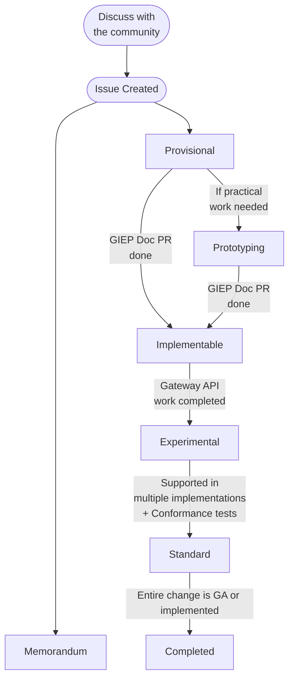

# Gateway Inference Enhancement Proposal (GIEP)

Gateway Inference Enhancement Proposals (GIEPs) serve a similar purpose to the
[GIEP](https://gateway-api.sigs.k8s.io/GIEPs/overview/) process for the main
Gateway API project:

1. Ensure that changes to the API follow a known process and discussion in the
  OSS community.
1. Make changes and proposals discoverable (current and future).
1. Document design ideas, tradeoffs, decisions that were made for historical
  reference.
1. Record the results of larger community discussions.
1. Record changes to the GIEP process itself.

## Process

This diagram shows the state diagram of the GIEP process at a high level, but
the details are below.

## GIEP Definitions

### GIEP States

Each GIEP has a state, which tracks where it is in the GIEP process.

GIEPs can move to some states from any other state:

  * **Declined**: The GIEP has been declined and further work will not occur.
  * **Deferred:** We do not currently have bandwidth to handle this GIEP, it may
    be revisited in the future.
  * **Declined:** This proposal was considered by the community but ultimately
  rejected.
  * **Withdrawn:** This proposal was considered by the community but ultimately
  withdrawn by the author.

There is a special state to cover Memorandum GIEPs:

  * **Memorandum**: These GIEPs either:
    * Document an agreement for further work, creating no spec changes
      themselves, or
    * Update the GIEP process.

API GIEPs flow through a number of states, which generally correspond to the
level of stability of the change described in the GIEP:

  * **Provisional:** The goals described by this GIEP have consensus but
    implementation details have not been agreed to yet.
  * **Prototyping:** An extension of `Provisional` which can be opted in to in
    order to indicate to the community that there are some active practical
    tests and experiments going on which are intended to be a part of the
    development of this GIEP. This may include APIs or code, but that content
    _must_ not be distributed with releases.
  * **Implementable:** The goals and implementation details described by this
    GIEP have consensus but have not been fully implemented yet.
  * **Experimental:** This GIEP has been implemented and is part of the
    "Experimental" release channel. Breaking changes are still possible, up to
    and including complete removal and moving to `Rejected`.
  * **Standard:** This GIEP has been implemented and is part of the "Standard"
    release channel. It should be quite stable.
  * **Completed**: All implementation work on this API GIEP has been completed.

### Relationships between GIEPs

GIEPs can have relationships between them. At this time, there are three
possible relationships:

* **Obsoletes** and its backreference **ObsoletedBy**: when a GIEP is made
  obsolete by another GIEP, and has its functionality completely replaced. The
  Obsoleted GIEP is moved to the **Declined** state.
* **Extends** and its backreference **ExtendedBy**: when a GIEP has additional
  details or implementation added in another GIEP.
* **SeeAlso**: when a GIEP is relevant to another GIEP, but is not affected in
  any other defined way.

Relationships are tracked in the YAML metadata files accompanying each GIEP.

### GIEP metadata file

Each GIEP has a YAML file containing metadata alongside it, please keep it up to
date as changes to the GIEP occur.

In particular, note the `authors`, and `changelog` fields, please keep those up
to date.

## Process

### 1. Discuss with the community

Before creating a GIEP, share your high level idea with the community. There are
several places this may be done:

- A [new GitHub
  Discussion](https://github.com/kubernetes-sigs/gateway-api/discussions/new)
- On our [Slack Channel](https://kubernetes.slack.com/archives/CR0H13KGA)
- On one of our [community
  meetings](https://gateway-api.sigs.k8s.io/contributing/?h=meetings#meetings)

Please default to GitHub discussions: they work a lot like GitHub issues which
makes them easy to search.

### 2. Create an Issue
[Create a GIEP
issue](https://github.com/kubernetes-sigs/gateway-api/issues/new?assignees=&labels=kind%2Ffeature&template=enhancement.md)
in the repo describing your change. At this point, you should copy the outcome
of any other conversations or documents into this document.

### 3. Agree on the Goals
Although it can be tempting to start writing out all the details of your
proposal, it's important to first ensure we all agree on the goals.

For API GIEPs, the first version of your GIEP should aim for a "Provisional"
status and leave out any implementation details, focusing primarily on "Goals"
and "Non-Goals".

For Memorandum GIEPs, the first version of your GIEP will be the only one, as
Memorandums have only a single stage - `Accepted`.

### 3. Document Implementation Details
Now that everyone agrees on the goals, it is time to start writing out your
proposed implementation details. These implementation details should be very
thorough, including the proposed API spec, and covering any relevant edge cases.
Note that it may be helpful to use a shared doc for part of this phase to enable
faster iteration on potential designs.

It is likely that throughout this process, you will discuss a variety of
alternatives. Be sure to document all of these in the GIEP, and why we decided
against them. At this stage, the GIEP should be targeting the "Implementable"
stage.

### 4. Implement the GIEP as "Experimental"

With the GIEP marked as "Implementable", it is time to actually make those
proposed changes in our API. In some cases, these changes will be documentation
only, but in most cases, some API changes will also be required. It is important
that every new feature of the API is marked as "Experimental" when it is
introduced. Within the API, we use `<gateway:experimental>` tags to denote
experimental fields. Within Golang packages (conformance tests, CLIs, e.t.c.) we
use the `experimental` Golang build tag to denote experimental functionality.

Some other requirements must be met before marking a GIEP `Experimental`:

- the graduation criteria to reach `Standard` MUST be filled out
- a proposed probationary period (see next section) must be included in the GIEP
  and approved by maintainers.

Before changes are released they MUST be documented. GIEPs that have not been
both implemented and documented before a release cut off will be excluded from
the release.

#### Probationary Period

Any GIEP in the `Experimental` phase is automatically under a "probationary
period" where it will come up for re-assessment if its graduation criteria are
not met within a given time period. GIEPs that wish to move into `Experimental`
status MUST document a proposed period (6 months is the suggested default) that
MUST be approved by maintainers. Maintainers MAY select an alternative time
duration for a probationary period if deemed appropriate, and will document
their reasoning.

> **Rationale**: This probationary period exists to avoid GIEPs getting "stale"
> and to provide guidance to implementations about how relevant features should
> be used, given that they are not guaranteed to become supported.

At the end of a probationary period if the GIEP has not been able to resolve its
graduation criteria it will move to "Rejected" status. In extenuating
circumstances an extension of that period may be accepted by approval from
maintainers. GIEPs which are `Rejected` in this way are removed from the
experimental CRDs and more or less put on hold. GIEPs may be allowed to move
back into `Experimental` status from `Rejected` for another probationary period
if a new strategy for achieving their graduation criteria can be established.
Any such plan to take a GIEP "off the shelf" must be reviewed and accepted by
the maintainers.

> **Warning**: It is extremely important** that projects which implement
> `Experimental` features clearly document that these features may be removed in
> future releases.

### 5. Graduate the GIEP to "Standard"

Once this feature has met the [graduation
criteria](/concepts/versioning/#graduation-criteria), it is time to graduate it
to the "Standard" channel of the API. Depending on the feature, this may include
any of the following:

1. Graduating the resource to beta
2. Graduating fields to "standard" by removing `<gateway:experimental>` tags
3. Graduating a concept to "standard" by updating documentation

### 6. Close out the GIEP issue

The GIEP issue should only be closed once the feature has:
- Moved to the standard channel for distribution (if necessary)
- Moved to a "v1" `apiVersion` for CRDs
- been completely implemented and has wide acceptance (for process changes).

In short, the GIEP issue should only be closed when the work is "done" (whatever
that means for that GIEP).

## Format

GIEPs should match the format of the template found in
[GIEP-696](/GIEPs/GIEP-696).

## Out of scope

What is out of scope: see [text from KEP][kep-when-to-use]. Examples:

* Bug fixes
* Small changes (API validation, documentation, fixups). It is always possible
  that the reviewers will determine a "small" change ends up requiring a GIEP.

## FAQ

#### Why is it named GIEP?
To avoid potential confusion if people start following the cross references to
the full GEP or KEP process.

#### Why have a different process than mainline?
Gateway API has some differences with most upstream KEPs. Notably Gateway API
intentionally avoids including any implementation with the project, so this
process is focused entirely on the substance of the API. As this project is
based on CRDs it also has an entirely separately release process, and has
developed concepts like "release channels" that do not exist in upstream.

#### Is it ok to discuss using shared docs, scratch docs etc?
Yes, this can be a helpful intermediate step when iterating on design details.
It is important that all major feedback, discussions, and alternatives
considered in that step are represented in the GIEP though. A key goal of GIEPs
is to show why we made a decision and which alternatives were considered. If
separate docs are used, it's important that we can still see all relevant
context and decisions in the final GIEP.

#### When should I mark a GIEP as `Prototyping` as opposed to `Provisional`?
The `Prototyping` status carries the same base meaning as `Provisional` in that
consensus is not complete between stakeholders and we're not ready to move
toward releasing content yet. You should use `Prototyping` to indicate to your
fellow community members that we're in a state of active practical tests and
experiments which are intended to help us learn and iterate on the GIEP. These
can include distributing content, but not under any release channel.

#### Should I implement support for `Experimental` channel features?
Ultimately one of the main ways to get something into `Standard` is for it to
mature through the `Experimental` phase, so we really _need_ people to implement
these features and provide feedback in order to have progress. That said, the
graduation of a feature past `Experimental` is not a forgone conclusion. Before
implementing an experimental feature, you should:

* Clearly document that support for the feature is experimental and may
  disappear in the future.
* Have a plan in place for how you would handle the removal of this feature from
  the API.

[kep]: https://github.com/kubernetes/enhancements
[kep-when-to-use]:
    https://github.com/kubernetes/enhancements/tree/master/keps#do-i-have-to-use-the-kep-process
