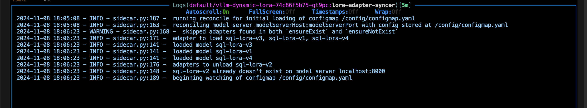
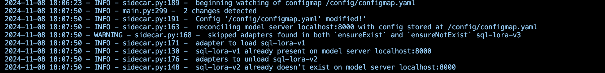

# Dynamic LORA Adapter Sidecar for vLLM

This is a sidecar-based tool to help rolling out new LoRA adapters to a set of running vLLM model servers. The user deploys the sidecar with a vLLM server, and using a ConfigMap, the user can express their intent as to which LoRA adapters they want to have the running vLLM servers to be configure with. The sidecar watches the ConfigMap and sends load/unload requests to the vLLM container to actuate on the user intent. 

## Overview

The sidecar continuously monitors a ConfigMap mounted as a YAML configuration file. This file defines the desired state of LORA adapters, including:

- **Adapter ID:** Unique identifier for the adapter.
- **Source:** Path to the adapter's source files.
- **Base Model:** The base model to which the adapter should be applied.
- **toRemove:** (Optional) Indicates whether the adapter should be unloaded.

The sidecar uses the vLLM server's API to load or unload adapters based on the configuration. It also periodically reconciles the registered adapters on the vLLM server with the desired state defined in the ConfigMap, ensuring consistency.

## Features

- **Dynamic Loading and Unloading:**  Load and unload LORA adapters without restarting the vLLM server.
- **Continuous Reconciliation:**  Ensures the vLLM server's state matches the desired configuration.
- **ConfigMap Integration:**  Leverages Kubernetes ConfigMaps for easy configuration management.
- **Easy Deployment:**  Provides a sample deployment YAML for quick setup.

## Repository Contents

- **`sidecar.py`:**  Python script for the sidecar container.
- **`Dockerfile`:**  Dockerfile to build the sidecar image.
- **`configmap.yaml`:**  Example ConfigMap YAML file.
- **`deployment.yaml`:**  Example Kubernetes deployment YAML.

## Usage

1. **Build the Docker Image:**
   ```bash
   docker build -t <your-image-name> .
2. **Create a configmap:**
    ```bash
    kubectl create configmap name-of-your-configmap --from-file=your-file.yaml
3. **Mount the configmap and configure sidecar in your pod**
    ```yaml
    volumeMounts: # DO NOT USE subPath
          - name: config-volume
            mountPath:  /config
    ```
    Do not use subPath, since configmap updates are not reflected in the file

[deployment]: deployment.yaml it uses [sidecar](https://kubernetes.io/docs/concepts/workloads/pods/sidecar-containers/)(`initContainer` with `restartPolicy` set to `always`) which is beta feature enabled by default since k8s version 1.29. They need to be enabled in 1.28 and prior to 1.28 sidecar are not officially supported.

## Configuration Fields
- `vLLMLoRAConfig`[**required**]  base key 
- `host` [*optional*]Model server's host. defaults to localhost
- `port` [*optional*] Model server's port. defaults to 8000
- `name`[*optional*] Name of this config
- `ensureExist`[*optional*] List of models to ensure existence on specified model server.
    -  `models`[**required**] [list]
        - `base-model`[*optional*] Base model for lora adapter
        - `id`[**required**] unique id of lora adapter
        - `source`[**required**] path (remote or local) to lora adapter
- `ensureNotExist` [*optional*]
    - `models`[**required**] [list]
        - `id`[**required**] unique id of lora adapter
        -  `source`[**required**] path (remote or local) to lora adapter
        - `base-model`[*optional*] Base model for lora adapter


## Screenshots & Testing
I tested the sidecar in my cluster with deployment and configmap specified in this repo. Here are the screen grabs of the logs from the sidecar and vllm server. I used the specified configmap, verified that the adapters were loaded by querying `v1/models` and looking at vllm logs. I changed the configmap and validated the same on vllm server. Note: There is slight lag between updates. 



